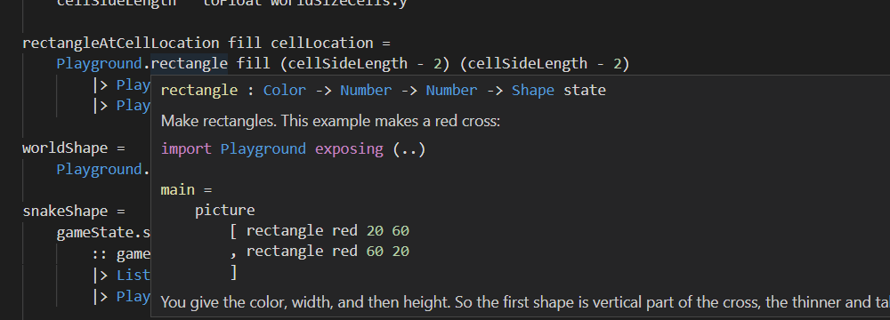

# Elm Editor

[Elm Editor](https://github.com/pine-vm/pine/tree/main/implement/example-apps/elm-editor) is a web app for developing Elm programs.

As an integrated development environment, it assists us in reading, writing, and testing Elm programs and in collaborating with other developers.

This project minimizes the friction for newcomers to get started with programming. Since the front-end is entirely web-based, it requires practically no setup. Any modern web browser is enough to use it.

To see Elm Editor in action, check out the public instance at https://elm-editor.com

This video is a short demonstration of a code editing cycle in Elm Editor:
https://youtu.be/x6RpeuLtiXY

## Overview of Features

+ Viewing and editing all Elm module files and the `elm.json` file.
+ Checking programs for problems such as Elm compiler errors.
+ Saving and sharing the current state of a workspace, including all files.
+ Importing complete workspaces from public git repositories.
+ For frontend web apps, viewing and testing the app in an iframe.

## Project Organization and Implementation

Elm Editor is an open-source project organized for easy customization and deployment of custom instances.

Most of the action happens in the front-end. The primary role of the back-end is integrating tools like the Elm and elm-format executable files and interfacing with Git hosting services like GitHub and GitLab.

The front-end is mainly written in Elm and integrates the [Monaco Editor](https://microsoft.github.io/monaco-editor/) from the VS Code project. The Elm app implements ports with the javascript-based Monaco Editor. The Elm side also implements language services that power editor features that require understanding the syntax and semantics of the Elm programming language.

## Saving and Sharing Workspaces

The 'Get Link to Workspace for Bookmarking or Sharing' dialog helps to persist or share the whole workspace state, including all files. This user interface encodes the workspace state in a hyperlink for easy sharing in mediums like emails, chat rooms, and websites.

### Anatomy of the Workspace Link URL

The workspace link URL we get from the UI contains three components:

+ A description of the tree structure containing the files. This description can have different shapes, as detailed in the 'Workspace State Models' section below.
+ A hash of the file tree structure. The app uses this redundant information to check for defects in the file tree and warn the user if necessary.
+ The path of the file that is currently opened in the code editor. When a user enters the workspace using the link, the editor opens this file again.

### Workspace State Models

The model describing the files in a workspace is optimized for typical training scenarios. Users often enter a workspace with a state as already modeled in a git repository in a subdirectory. Using an URL to a git tree in hosting services like GitHub or GitLab is sufficient to describe the workspace state. The editor then contacts the corresponding git hosting service to load the git repository contents. While loading is in progress, the app displays a message informing about the loading operation.

An example of such an URL to a git tree is <https://github.com/onlinegamemaker/making-online-games/tree/50a1e1a8c5f6edebfd834016fb609b7baa19954b/games-program-codes/simple-snake>

The corresponding URL into the editor looks like this:
<https://elm-editor.com/?workspace-state=https%3A%2F%2Fgithub.com%2Fonlinegamemaker%2Fmaking-online-games%2Ftree%2F50a1e1a8c5f6edebfd834016fb609b7baa19954b%2Fgames-program-codes%2Fsimple-snake>

When a user started with a state from a git tree and made some changes, generating a link will encode the workspace state as the difference relative to that git tree. This encoding leads to much smaller URLs. Like in the case of a pure git URL, the editor loads the base from the third-party service. When the loading from git is complete, Elm Editor applies the changes encoded with the URL on top to compute the final file tree.

### Compression of the Workspace State Model

To make the links into workspaces even smaller, the interface to save a workspace compresses the workspace state model using the deflate algorithm. This compressed representation appears in the `workspace-state-deflate-base64` query parameter in the final link URL.

## Code Editor

The code editor is a central part of an IDE. Elm Editor integrates the [Monaco Editor](https://microsoft.github.io/monaco-editor/) from the VS Code project. The Elm app implements ports with the javascript-based Monaco Editor. The Elm side also implements language services that power editor features that require understanding the syntax and semantics of the Elm programming language. With this combination of Monaco Editor and Elm language services, Elm Editor provides a range of IDE features, including the following:

+ Visual markers in the code to quickly find locations of problems.
+ Showing error descriptions on mouse hover.
  
+ Completion suggestions to discover available declarations and explore useful codes.
  
+ Showing documentation and details when hovering the mouse cursor over a part of the code.
  
+ Command palette to discover new functionality and keyboard shortcuts.
+ Text search with options for case sensitivity, regular expressions, and replacing matches.
+ Minimap for improved navigation of large documents.
